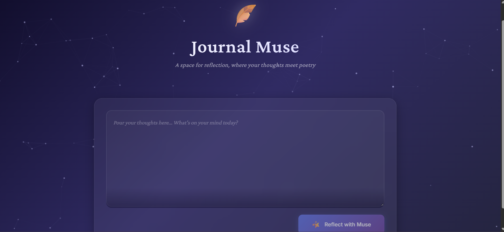

# 🪶 Journal Muse — AI-Powered Poetic Journal

**Journal Muse** is a minimalist experimental journaling app powered by GPT‑3.5. It offers a gentle, modern space where users can reflect and receive poetic, empathetic responses from an AI “Muse.” Built with **React + Flask + OpenAI**, it showcases clean full-stack architecture and thoughtful UI.

---

## ✨ Features

- 📝 Elegant journaling interface with animations
- 🤖 GPT‑3.5-powered poetic reflections
- 🎨 Particle background and glassmorphism styling
- ⚙️ REST API using Flask and OpenAI SDK
- 📱 Responsive design for desktop & mobile

---

## 🛠 Tech Stack

**Frontend**
- React 18 (Hooks + Components)
- Framer Motion (animations)
- Axios (API requests)
- Canvas API + Custom CSS

**Backend**
- Python 3 + Flask
- OpenAI Python SDK
- Flask-CORS
- python-dotenv

---

## 🚀 How to Run Locally

```bash
# 1. Clone the repository
git clone https://github.com/your-username/journal-muse.git
cd journal-muse

# 2. Set up backend
python -m venv venv
source venv/bin/activate       # Windows: .\venv\Scripts\activate
pip install -r requirements.txt

# 3. Configure OpenAI
cp .env.example .env
# Edit .env and add:
# OPENAI_API_KEY=your_api_key_here

# 4. Run the Flask server
python app.py
```

```bash
# 5. Set up frontend (in a new terminal)
cd frontend
npm install
npm start
```

---

## 📂 Project Structure

```
journal-muse/
├── app.py               # Flask backend
├── requirements.txt
├── .env.example
├── frontend/            # React frontend
│   ├── src/
│   │   ├── components/
│   │   ├── App.js
│   │   └── ParticleBackground.js
└── README.md
```

---

## 📸 Screenshots



---

## 📜 License

Released under the **MIT License** — free to use, modify, and share with credit.

---

**Built for reflection, expression, and a touch of poetic tech.**
